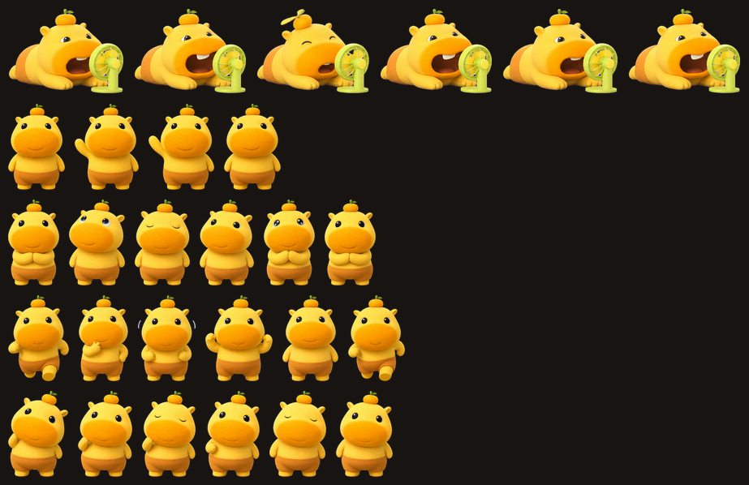

# 🦫 水豚噜噜 · DSH 主题皮肤

把 DeepSeek Harness（DSH）换成「水豚噜噜」主题风格的皮肤插件仓库。

- **自由切换**：插件内置「噜噜·奶油咖啡」（浅色）与「噜噜·暖夜」（深色）两套主题，可随时在设置里切换或恢复原版。
- **宠物内置**：水豚噜噜（头顶橘子）以动画形式常驻界面角落，会摇摇、会挥手。
- **一键分发**：单文件插件源码，任何 DSH 会话都可以直接安装。

## 目录

| 路径 | 说明 |
| --- | --- |
| `plugin/` | 皮肤插件源码（内置帧动画与主题令牌） |
| `assets/` | 噜噜 spritesheet、提取帧、预览图 |
| `scripts/` | 帧提取与插件构建脚本 |
| `docs/` | 使用与维护文档 |

## 快速安装

> 详细步骤见 `docs/INSTALL.md`

1. 打开你的 DSH 会话，把 `plugin/client.js` 的完整内容粘贴给模型；
2. 或直接说："安装 docs/INSTALL.md 里的噜噜皮肤"。

## 预览

## 许可

水豚噜噜形象与皮肤设计为少卿（shaoqing404）所有。见 LICENSE。
